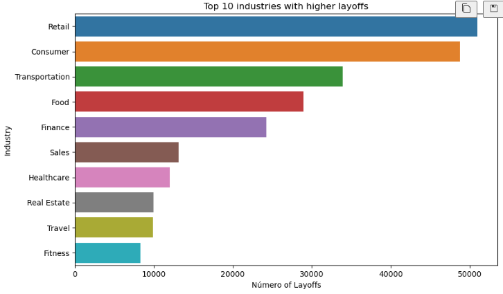
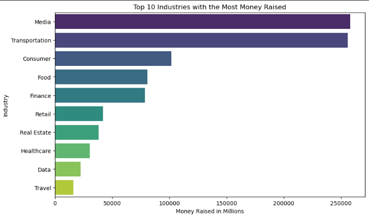
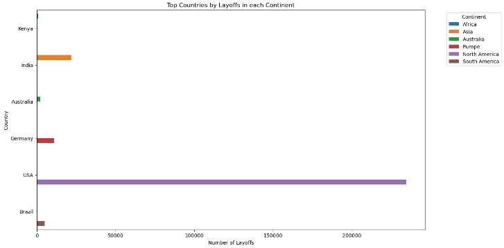
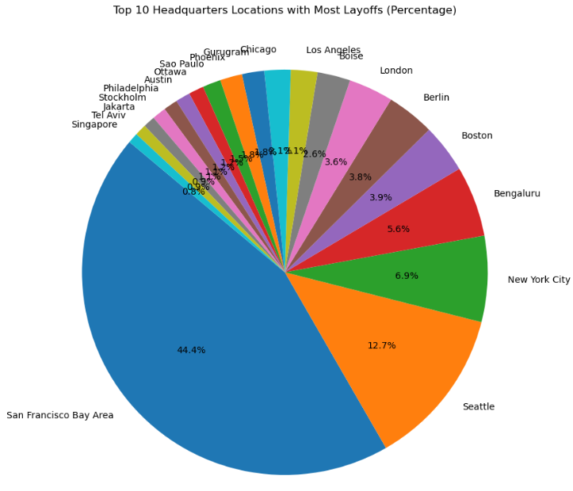
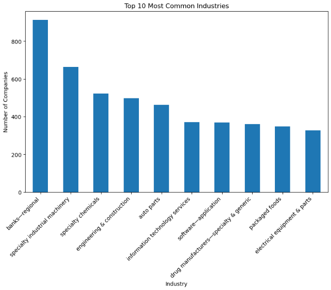
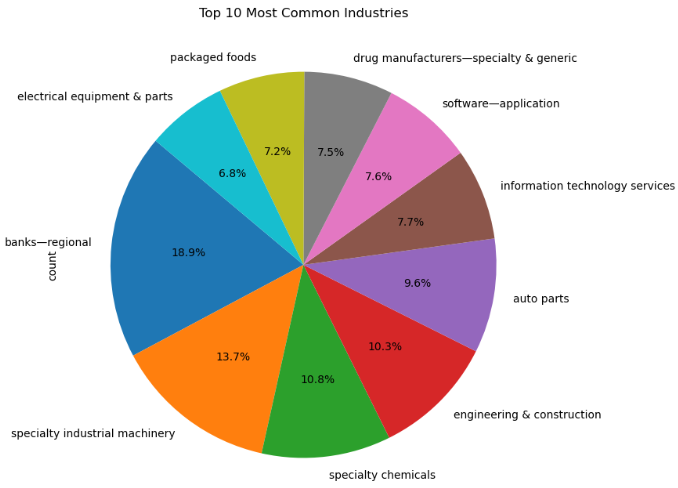
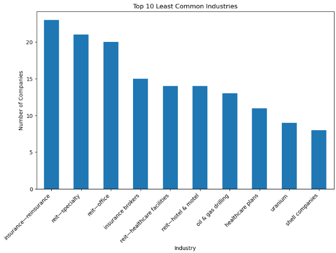
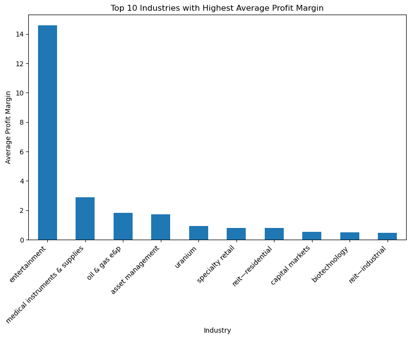
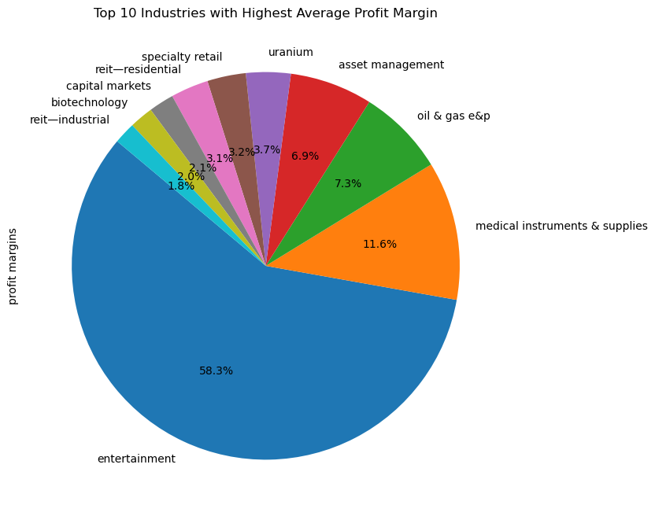
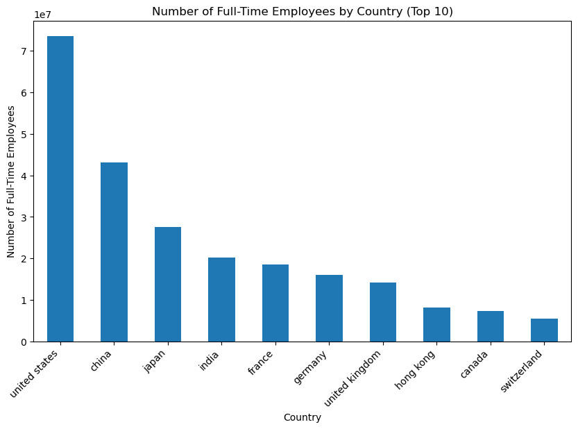

# DataDive - Tech Layoffs analysis


<p align="left">
    
</p>

<p align="left"> 
     
    

`Proyecto ETL (Extract, transform and load)`

---
```
▓█████▄  ▄▄▄     ▄▄▄█████▓ ▄▄▄      ▓█████▄  ██▓ ██▒   █▓▓█████ 
▒██▀ ██▌▒████▄   ▓  ██▒ ▓▒▒████▄    ▒██▀ ██▌▓██▒▓██░   █▒▓█   ▀ 
░██   █▌▒██  ▀█▄ ▒ ▓██░ ▒░▒██  ▀█▄  ░██   █▌▒██▒ ▓██  █▒░▒███   
░▓█▄   ▌░██▄▄▄▄██░ ▓██▓ ░ ░██▄▄▄▄██ ░▓█▄   ▌░██░  ▒██ █░░▒▓█  ▄ 
░▒████▓  ▓█   ▓██▒ ▒██▒ ░  ▓█   ▓██▒░▒████▓ ░██░   ▒▀█░  ░▒████▒
 ▒▒▓  ▒  ▒▒   ▓▒█░ ▒ ░░    ▒▒   ▓▒█░ ▒▒▓  ▒ ░▓     ░ ▐░  ░░ ▒░ ░
 ░ ▒  ▒   ▒   ▒▒ ░   ░      ▒   ▒▒ ░ ░ ▒  ▒  ▒ ░   ░ ░░   ░ ░  ░
 ░ ░  ░   ░   ▒    ░        ░   ▒    ░ ░  ░  ▒ ░     ░░     ░   
   ░          ░  ░              ░  ░   ░     ░        ░     ░  ░
 ░                                   ░               ░          
```
---

## Table of Contents
1. [DataDive - Tech Layoffs analysis](#datadive---tech-layoffs-analysis)
2. [Introduction](#introduction)
3. [Objectives](#objectives)
    1. [General Objectives](#general-objectives)
    2. [Specific Objectives](#specific-objectives)
4. [Installation](#installation)
5. [Participants](#participants)
6. [Findings - EDA tech layoffs](#findings---eda-tech-layoffs)
7. [Findings - Dimensional Model and Dashboard](#findings---dimensional-model-and-dashboard)
8. [Findings - APIs](#findings---apis)
9. [Dashboards](#dashboards)
10. [Tech Layoffs Dataset EDA charts](#tech-layoffs-dataset-eda-charts)
11. [APIs EDA charts](#apis-eda-charts)

## Introduction

In the rapidly evolving landscape of the tech sector, **understanding the trends and patterns** of workforce adjustments can provide valuable insight into the health of different industries, the economic factors at play, and **future projections**. This project is dedicated to an in-depth analysis of layoffs in the tech sector between 2020 and 2024, a period marked by significant **global changes** that have affected all sectors.
The main goal of this analysis is to uncover patterns and insights from the data. This involves examining various dimensions, such as the geographical distribution of layoffs, the scale of layoffs relative to the size of the companies, temporal trends, and the correlation between layoffs and some external economic factors.

## Objectives

### General Objectives

- Analyze the dynamics of layoffs in the tech sector.
- Identify patterns and trends.

### Specific Objectives

- Analyze the geographic distribution of layoffs.
- Identify temporal trends of layoffs.
- Assess the scale of layoffs relative to company sizes.

### EDA (Exploratory Data Analysis)

- The EDA aimed to understand the data better and make informed decisions. Notably, it uncovered that the relation between industries with high layoffs and those with significant economic losses was weak, suggesting layoffs didn't always correlate with economic impact.
- A significant geographic trend was identified, with North America, particularly the United States, accounting for a vast majority of the data. The Bay Area of San Francisco emerged as a significant location, highlighting regional impacts on tech layoffs.

### Dimensional Model and Dashboard

- The dimensional model and dashboard aimed to provide a comprehensive view of the data, allowing for easy interpretation and analysis. The model was designed to provide insights into the industry, location, and company size dimensions, while the dashboard visualized key metrics and trends.

### APIs

- The APIs analysis aimed to provide additional context to the data, offering insights into the global market landscape. The analysis revealed that the distribution of companies by country was concentrated in China, the United States, India, and Japan, with the United States having the highest number of employees.

## Installation

In order to run the code and connect to the Database you'll need a `dotenv` file with the following credential, you also can work with the data by yourself using the [raw data](/raw_data/tech_layoffs.xlsx)

``` DB_USERNAME='
DB_PASSWORD=''
DB_HOST=''
DB_PORT=
DB_NAME=''
```

Now that you have the `.env` file you beed to set up your environment with the following command:

```bash
python3 -m venv venv
source venv/bin/activate
pip install -r requirements.txt
```

now you can run the import_data script to load the data into your database:

```bash
python3 code/import_data.py
```

to create the dimensional model you can run the following scripts on your PSQL database to create the necessary tables:

*fact table:*
```sql
CREATE TABLE fact_layoffs (
    fact_id SERIAL PRIMARY KEY,
    date_id INT,
    location_id INT,
    company_id INT,
    laid_off INT,
    percentage DECIMAL(5,2),
    company_size_before_layoffs INT,
    company_size_after_layoffs INT,
    money_raised_in_mil DECIMAL(12,2),
    FOREIGN KEY (date_id) REFERENCES dim_time (date_id),
    FOREIGN KEY (location_id) REFERENCES dim_location (location_id),
    FOREIGN KEY (company_id) REFERENCES dim_company (company_id)
);
```
*dimensions:*

*dim_time:*
```sql
CREATE TABLE dim_time (
    date_id INT PRIMARY KEY,
    date DATE,
    year INT
);
```
*dim_location:*
```sql
CREATE TABLE dim_location (
    location_id SERIAL PRIMARY KEY,
    location_hq VARCHAR(255),
    country VARCHAR(100),
    continent VARCHAR(100),
    latitude DECIMAL(9,6),
    longitude DECIMAL(9,6)
);
```

*dim_company:*
```sql
CREATE TABLE dim_company (
    company_id SERIAL PRIMARY KEY,
    company VARCHAR(255),
    industry VARCHAR(100),
    stage VARCHAR(100)
);
```

now you can run the dimensional model script to populate the tables:

```bash
python3 code/dimensional_model.py
```

and finally to get the data from the apis on a csv file you can run the following script (the data will be saved in the `Data_API` folder):

```bash
python3 API/API_PROCESS_EXTRACT.py
```

Remember that you can always check the Analysis and the EDA in the `API` folder for the API data and in the `code` folder for the dimensional model.


## Participants

- FEDERICO GONZALEZ
- ISAAC PIEDRAHITA 

## Findings - EDA tech layoffs

- The analysis reveals no direct correlation between industries with high layoffs and those with substantial economic losses, indicating a complex relationship between layoffs and financial impact.
- Geographic trends show a significant focus on North America, with the San Francisco Bay Area, Seattle, and New York being notable for high numbers of layoffs.
- Temporal trends highlighted a significant increase in layoffs in 2023, despite not being the year with the highest number of layoff records. The year 2020 also saw a spike in layoffs attributed to the pandemic.

## Findings - Dimensional Model and Dashboard

- The industry with the most layoff records in the United States is the finance industry (15%). With a 6% difference in records compared to the second place, the retail industry (8.6%).
- The industry with the highest total number of layoffs in the United States is the consumer industry with over 4,000 layoffs; this industry refers to the sector that produces goods and services intended for consumption by individuals (services, durable goods, and non-durable goods).
- The retail industry is consolidated as the second industry with the highest total number of layoffs and the highest number of layoff records, suggesting that this industry has been undergoing many changes or challenges from 2020 to 2023. This is due to various factors that we cannot confirm, but let's remember that we are covering years where the pandemic was still present in this country and industries like these had to adapt to new forms of non-physical sales.
- The year 2023 leads as the year with the highest number of layoffs in almost all industries in the United States, followed by the year 2022, which is present with more layoffs in the food, health, and hardware industries. Interestingly, 2022 is the year that leads with the highest number of records in the United States.

We can see how the size of industries before and after layoffs does not change drastically, maintaining the same "position" for most industries, but there are cases like the sales industry whose size ends up being smaller than that of the transportation industry after the layoffs it suffered.

## Findings - APIs

- The distribution of companies by country in the market is mainly concentrated in four countries: China with 23.2%, the United States with 19.9%, India with 19.8%, and Japan with 16.4%. Following these countries, the distribution becomes much smaller, with the United Kingdom at 4.7% and Hong Kong at 4.2%.
- Unlike our layoff dataset where over 60% of records were from the United States, this API dataset shows a more even distribution across several countries, though the United States remains prominent.
- In terms of industry distribution in our market dataset, regional banks dominate with 18.9%, followed by specialized industries and engineering sectors like machinery and chemicals. The least represented industries are insurance with only 20-25 records and several real estate subcategories, each with about 20-13 companies.
- The most profitable industry according to our market dataset is the entertainment industry, with a profit margin of 57%, significantly higher than other sectors.
- The countries with the most full-time employees are the United States with 31.5%, China with 18.4%, Japan with 11.8%, and India with 8.6%. While these are the same leading market countries, their roles shift with the United States having the highest number of employees.
- A general analysis of employee distribution by industry shows that sectors like banking, healthcare, and technology services dominate, as these are essential services required around the clock in any society and market."

## Dashboards

<!--*Explore interactive visualizations and key findings in our [Dashboard overview](https://lookerstudio.google.com/reporting/a1ccda3f-5fa6-4e15-8237-0cdd0bcfad87).*-->

<!---->

*API Dashboard:*
[](README.md-data/API_Dashboard.png)

*Dimentional model 1st dashboard:*


*Dimentional model 2nd dashboard:*


## Tech Layoffs Dataset EDA charts

*Figure 1: Layoffs by industry*


*Figure 2: Top 10 industries with higher layoffs*


*Figure 3: Top 10 Industries with the Lowest Layoffs*


*Figure 4: Top 10 Industries with the Most Money Raised*


*Figure 5: Top Countries by Layoffs in each Continent*


*Figure 6: Percentage of Layoffs by Continent*


*Figure 7: Percentage of Layoffs by Continent and Country*


*Figure 8: Top 10 Headquarters Locations with Most Layoffs*


*Figure 9: Top 10 Headquarters Locations with Most Layoffs (Percentage)*


*Figure 10: Temporal Evolution of Layoffs*


<!-- https://github.com/Isaac-opz/DataDive-TechLayoffs.git -->

## APIs EDA charts

*Figure 1: Distribution of Companies by Country*


*Figure 2: Top 10 most common industries in the market*


*Figure 3: Most profitable industry (cake chart)*


*Figure 4: Top 10 least common industries in the market*


*Figure 5: Top 10 industries with highest avg profit margin*


*Figure 6: Top 10 industries with highest avg profit margin (cake chart)*


*Figure 7: Number of Full-Time Employees by Country*


*Figure 8: Percentage of Full-Time Employees by Country*


*Figure 9: Distribution by percentage of Employees by Industry (top 10)*


*Figure 10: Distribution by percentage of Employees by Industry (top 50)*
