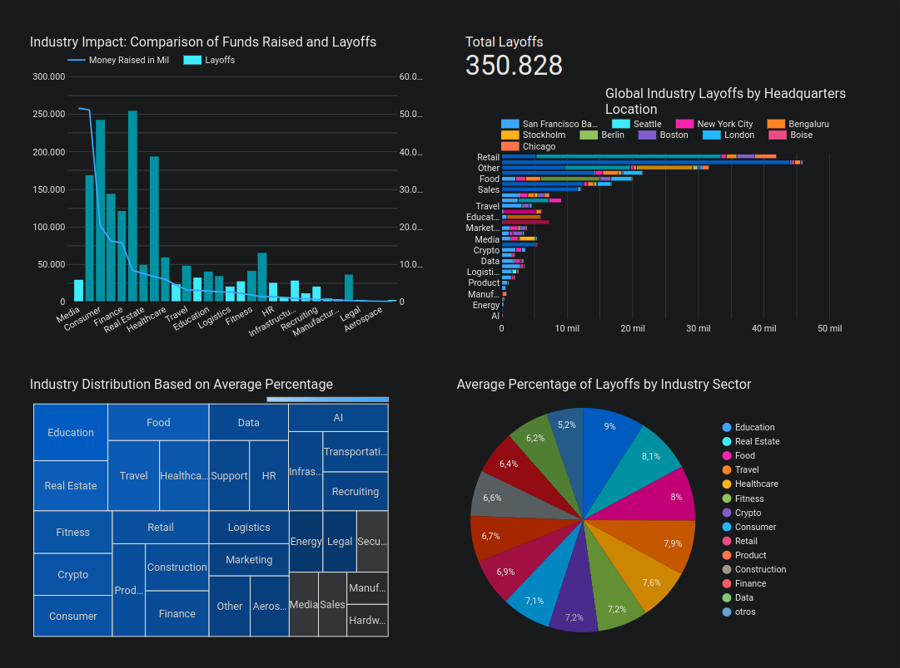
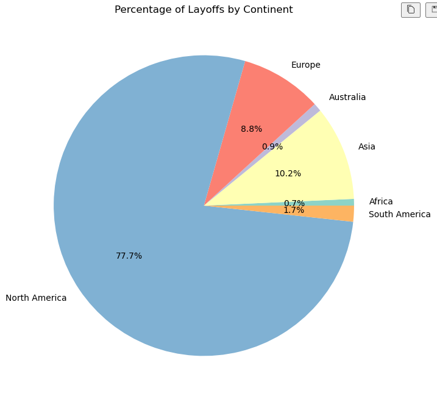
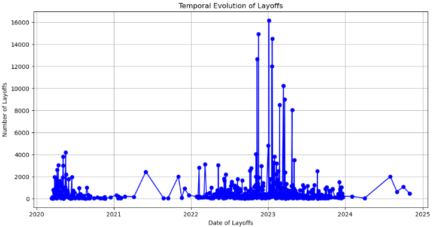

# DataDive - Tech Layoffs analysis

<p align="left">
    
</p>

<p align="left"> 
     
    

`Proyecto ETL (Extract, transform and load)`

## Index

1. [Introduction](#introduction)
2. [Objectives](#objectives)
    1. [General Objectives](#general-objectives)
    2. [Specific Objectives](#specific-objectives)
3. [Installation](#installation)
4. [Participants](#participants)
5. [Dashboard](#dashboard)
6. [Findings](#findings)

## Introduction

In the rapidly evolving landscape of the tech sector, **understanding the trends and patterns** of workforce adjustments can provide valuable insight into the health of different industries, the economic factors at play, and **future projections**. This project is dedicated to an in-depth analysis of layoffs in the tech sector between 2020 and 2024, a period marked by significant **global changes** that have affected all sectors.
The main goal of this analysis is to uncover patterns and insights from the data. This involves examining various dimensions, such as the geographical distribution of layoffs, the scale of layoffs relative to the size of the companies, temporal trends, and the correlation between layoffs and some external economic factors.

## Objectives

### General Objectives

- Analyze the dynamics of layoffs in the tech sector.
- Identify patterns and trends.

### Specific Objectives

- Analyze the geographic distribution of layoffs.
- Identify temporal trends of layoffs.
- Assess the scale of layoffs relative to company sizes.

### EDA (Exploratory Data Analysis)

- The EDA aimed to understand the data better and make informed decisions. Notably, it uncovered that the relation between industries with high layoffs and those with significant economic losses was weak, suggesting layoffs didn't always correlate with economic impact.
- A significant geographic trend was identified, with North America, particularly the United States, accounting for a vast majority of the data. The Bay Area of San Francisco emerged as a significant location, highlighting regional impacts on tech layoffs.

## Installation

In order to run the code and connect to the Database you'll need a `dotenv` file with the following credential, you also can work with the data by yourself using the [raw data](/raw_data/tech_layoffs.xlsx)

``` DB_USERNAME='
DB_PASSWORD=''
DB_HOST=''
DB_PORT=
DB_NAME=''
```

## Participants

- GRACE SANCHEZ
- FEDERICO GONZALEZ
- ISAAC PIEDRAHITA

## Findings

- The analysis reveals no direct correlation between industries with high layoffs and those with substantial economic losses, indicating a complex relationship between layoffs and financial impact.
- Geographic trends show a significant focus on North America, with the San Francisco Bay Area, Seattle, and New York being notable for high numbers of layoffs.
- Temporal trends highlighted a significant increase in layoffs in 2023, despite not being the year with the highest number of layoff records. The year 2020 also saw a spike in layoffs attributed to the pandemic.

## Dashboard

*Explore interactive visualizations and key findings in our [Dashboard overview](https://lookerstudio.google.com/reporting/a1ccda3f-5fa6-4e15-8237-0cdd0bcfad87).*



## EDA charts

*Figure 1: Layoffs by industry*


*Figure 2: Top 10 industries with higher layoffs*


*Figure 3: Top 10 Industries with the Lowest Layoffs*


*Figure 4: Top 10 Industries with the Most Money Raised*


*Figure 5: Top Countries by Layoffs in each Continent*


*Figure 6: Percentage of Layoffs by Continent*


*Figure 7: Percentage of Layoffs by Continent and Country*


*Figure 8: Top 10 Headquarters Locations with Most Layoffs*


*Figure 9: Top 10 Headquarters Locations with Most Layoffs (Percentage)*


*Figure 10: Temporal Evolution of Layoffs*

