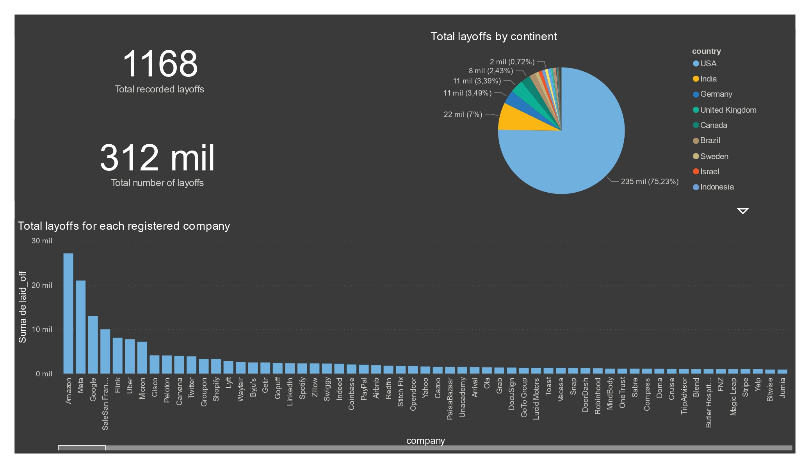

## Dashboards

<!--*Explore interactive visualizations and key findings in our [Dashboard overview](https://lookerstudio.google.com/reporting/a1ccda3f-5fa6-4e15-8237-0cdd0bcfad87).*-->

<!---->

*API Dashboard:*

*Dimentional model 1st dashboard:*

*Dimentional model 2nd dashboard:*

*Real-time dashboard first slide:*

*Real-time dashboard second slide:*

*Real-time dashboard third slide:*

*Dashboard Merged (Tech_Layoffs and FinancialingModelingAPI):*

## Tech Layoffs Dataset EDA charts

*Figure 1: Layoffs by industry*

*Figure 2: Top 10 industries with higher layoffs*

*Figure 3: Top 10 Industries with the Lowest Layoffs*

*Figure 4: Top 10 Industries with the Most Money Raised*

*Figure 5: Top Countries by Layoffs in each Continent*

*Figure 6: Percentage of Layoffs by Continent*

*Figure 7: Percentage of Layoffs by Continent and Country*

*Figure 8: Top 10 Headquarters Locations with Most Layoffs*

*Figure 9: Top 10 Headquarters Locations with Most Layoffs (Percentage)*

*Figure 10: Temporal Evolution of Layoffs*

<!-- https://github.com/Isaac-opz/DataDive-TechLayoffs.git -->

## APIs EDA charts

*Figure 1: Distribution of Companies by Country*

*Figure 2: Top 10 most common industries in the market*

*Figure 3: Most profitable industry (cake chart)*

*Figure 4: Top 10 least common industries in the market*

*Figure 5: Top 10 industries with highest avg profit margin*

*Figure 6: Top 10 industries with highest avg profit margin (cake chart)*

*Figure 7: Number of Full-Time Employees by Country*

*Figure 8: Percentage of Full-Time Employees by Country*

*Figure 9: Distribution by percentage of Employees by Industry (top 10)*

*Figure 10: Distribution by percentage of Employees by Industry (top 50)*
